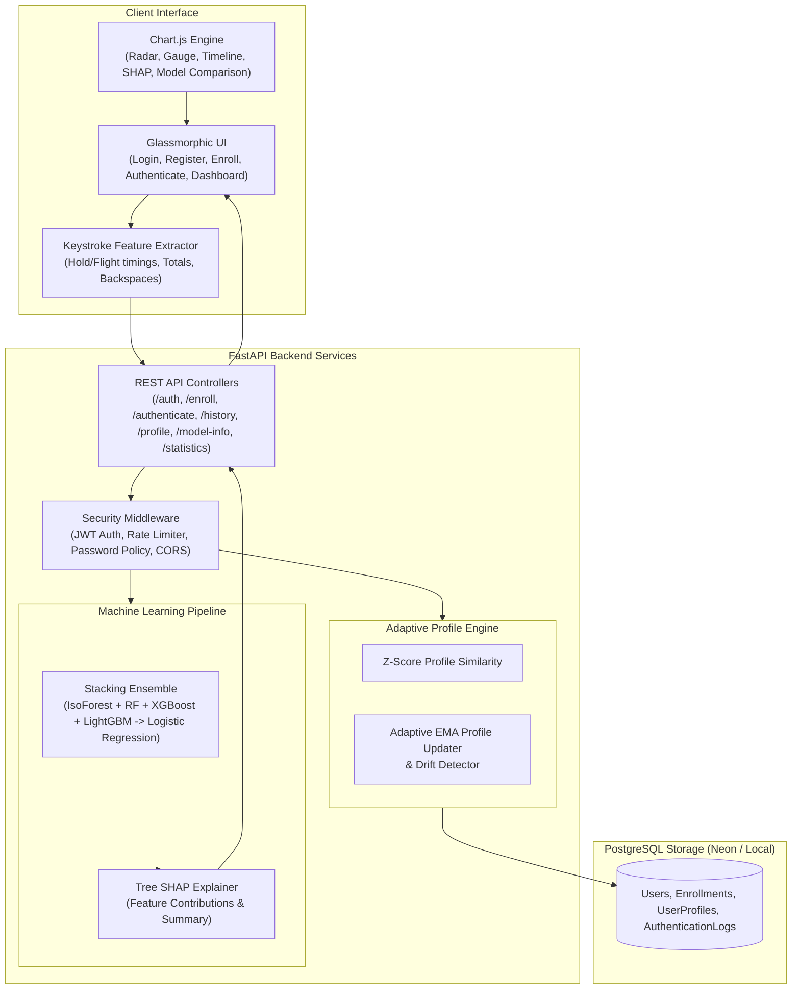

# KeyShield AI 🛡️
### AI Behavioral Biometric Authentication Platform

[](https://python.org)
[](https://fastapi.tiangolo.com)
[](https://scikit-learn.org)
[](https://xgboost.ai)
[](https://lightgbm.readthedocs.io)
[](https://shap.readthedocs.io)
[](https://postgresql.org)

**KeyShield AI** is an enterprise-grade AI-powered Behavioral Biometric Authentication Platform that continuously verifies user identity based on unique keystroke dynamics (hold times, flight times, total durations, and correction habits).

Unlike static password systems, KeyShield AI implements a **Tri-Layer Biometrics Decision Engine** combining a **Stacking Ensemble Machine Learning Pipeline** (Isolation Forest, Random Forest, XGBoost, LightGBM -> Logistic Regression Meta-Learner), a **Z-Score Profile Engine**, and **Tree SHAP Explainability (XAI)**.

---

## 🌟 Key Features

- **🚀 Stacking Ensemble Architecture**: Out-Of-Fold (OOF) cross-validated stacking ensemble combining Isolation Forest, Random Forest, XGBoost, and LightGBM base models with a Logistic Regression meta-learner (**92.09% Accuracy, 0.9302 ROC-AUC**).
- **🔍 Explainable AI (SHAP Integration)**: Provides local and global feature attribution using Tree SHAP, explaining *why* an authentication attempt was classified as genuine or suspicious.
- **⚡ Tri-Layer Biometric Fusion**: Combines Stacking Ensemble Probability (50%), Statistical Profile Similarity (35%), and Isolation Forest Anomaly Scores (15%) for robust decision-making.
- **📊 Adaptive Profile Engine**: Multi-sample baseline enrollment with Exponential Moving Average (EMA, $\alpha=0.1$) profile adaptation and real-time behavioral drift detection.
- **🛡️ Glassmorphism Security Dashboard**: Modern, responsive dark-mode UI with Chart.js visualizations (Radar Chart, Donut Risk Gauge, Timeline, SHAP Feature Importance, and Model Benchmarks).
- **🔒 Enterprise Security**: JWT Bearer token authentication, bcrypt password hashing, input validation, and IP-based rate limiting.

---

## 📐 System Architecture



---

## 📊 Stacking Ensemble Benchmark Performance

Evaluation on 15,300 benchmark keystroke dynamic samples:

| Model Name | Accuracy | Precision | Recall | F1-Score | ROC-AUC | Equal Error Rate (EER) |
| :--- | :---: | :---: | :---: | :---: | :---: | :---: |
| **Isolation Forest** | 87.29% | 89.39% | 96.16% | 0.9265 | 0.8821 | 18.59% |
| **Random Forest** | 92.39% | 93.11% | 98.12% | 0.9555 | 0.9258 | 14.27% |
| **XGBoost** | 91.90% | 93.30% | 97.25% | 0.9524 | 0.9286 | 14.27% |
| **LightGBM** | 92.06% | 93.41% | 97.33% | 0.9533 | 0.9261 | 14.75% |
| **🏆 Stacking Ensemble** | **92.09%** | **93.29%** | **97.53%** | **0.9536** | **0.9302** | **13.98%** |

---

## 📁 Repository Directory Structure

```
KeyShield_AI/
├── backend/
│   ├── api/                 # REST API Routers (auth, enroll, authenticate, history, profile, model-info, statistics)
│   ├── core/                # Config, JWT Security, Rate Limiter & Dependencies
│   ├── db/                  # SQLAlchemy Database Models, Database Session & Pydantic Schemas
│   ├── ml/                  # Stacking Ensemble Trainer, Predictor & Adaptive Profile Engine
│   ├── xai/                 # Tree SHAP Explainer Module
│   └── main.py              # FastAPI Application Entry Point
├── data/
│   ├── raw/                 # DSL-StrongPasswordData.csv (CMU Keystroke Benchmark)
│   └── processed/           # Processed statistical features dataset
├── frontend/
│   ├── css/                 # Glassmorphism design tokens & styles
│   ├── js/                  # API client, Feature Extractor, Page Logic & Chart.js Visualizations
│   ├── index.html           # Landing page
│   ├── login.html           # Login page
│   ├── register.html        # Registration page
│   ├── enroll.html          # Interactive multi-sample keystroke recorder
│   ├── authenticate.html    # Biometric authentication tester
│   └── dashboard.html       # Analytics dashboard
├── tests/                   # Automated pytest test suites (Auth, Stacking, XAI, APIs)
├── .env.example             # Environment variable template
├── render.yaml              # Render deployment configuration
├── vercel.json              # Vercel deployment configuration
└── README.md                # Documentation
```

---

## 🔌 REST API Specifications

| Method | Endpoint | Description | Auth Required |
| :--- | :--- | :--- | :---: |
| `POST` | `/register` | User Registration with password complexity validation | ❌ |
| `POST` | `/login` | User Login & JWT Access Token issuance | ❌ |
| `POST` | `/enroll` | Multi-sample keystroke profile enrollment (3 samples min) | ✅ |
| `POST` | `/authenticate` | Evaluate biometrics via Stacking Ensemble + SHAP + Profile | ✅ |
| `GET` | `/history` | Paginated user authentication logs & SHAP explanations | ✅ |
| `GET` | `/profile` | User behavioral profile baseline & drift metrics | ✅ |
| `GET` | `/model-info` | Stacking ensemble architecture & benchmark performance | ❌ |
| `GET` | `/statistics` | User and system-level biometrics analytics | ✅ |

---

## 💻 Local Setup & Installation

### 1. Prerequisites
- Python 3.10+
- PostgreSQL (or local SQLite fallback)

### 2. Installation
```bash
git clone https://github.com/gyana10/KeyShield-AI.git
cd KeyShield-AI

# Create virtual environment
python -m venv venv
venv\Scripts\activate  # On Windows

# Install dependencies
pip install -r backend/requirements.txt
```

### 3. Initialize Database & Train Models
```bash
# Set environment variables
cp .env.example .env

# Initialize database schema
python -m backend.db.init_db

# Train Stacking Ensemble ML models
python -m backend.ml.train
```

### 4. Run Server & Application
```bash
# Start FastAPI backend server
uvicorn backend.main:app --reload --port 8000
```
Open `frontend/index.html` in your browser or serve via Live Server.

### 5. Run Automated Tests
```bash
pytest tests/ -v
```

---

## 🌐 Free Cloud Deployment Instructions

### 1. Database Deployment (Neon PostgreSQL)
1. Sign up at [Neon.tech](https://neon.tech) (Free Tier).
2. Create a database project named `keyshield`.
3. Copy the PostgreSQL connection string URI.

### 2. Backend Deployment (Render)
1. Sign up at [Render.com](https://render.com) (Free Tier).
2. Click **New +** -> **Blueprint**.
3. Connect your GitHub repository `gyana10/KeyShield-AI`.
4. Render will automatically detect `render.yaml`.
5. Set environment variable `DATABASE_URL` to your Neon PostgreSQL URI.

### 3. Frontend Deployment (Vercel)
1. Sign up at [Vercel.com](https://vercel.com) (Free Tier).
2. Click **Add New Project** and import `gyana10/KeyShield-AI`.
3. Vercel will automatically configure static deployment via `vercel.json`.

---

## 📄 License
This project is licensed under the MIT License - see the LICENSE file for details.